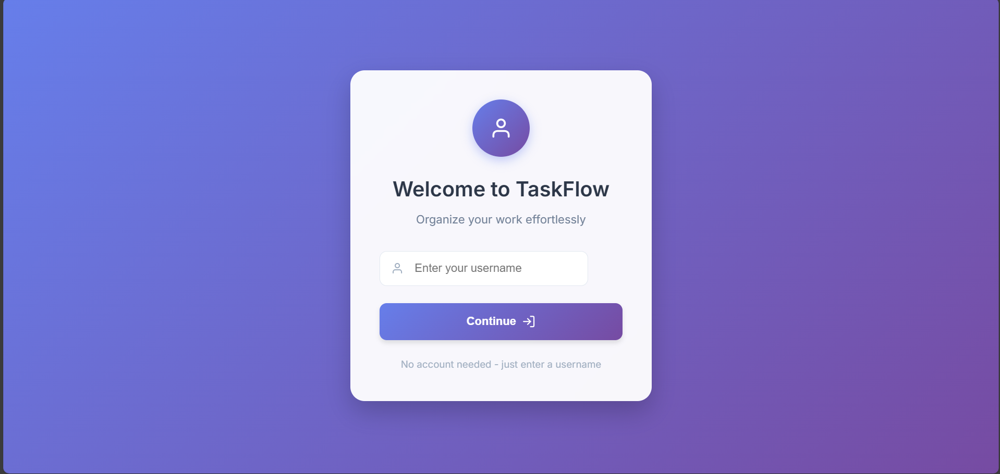
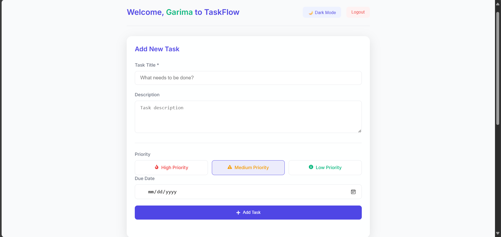
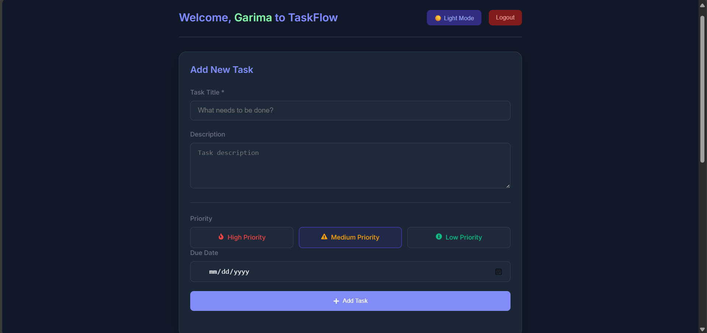
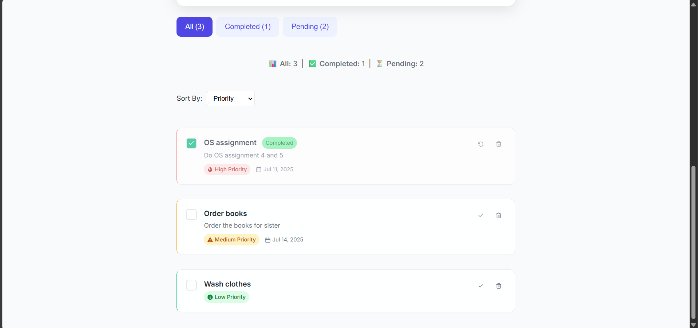
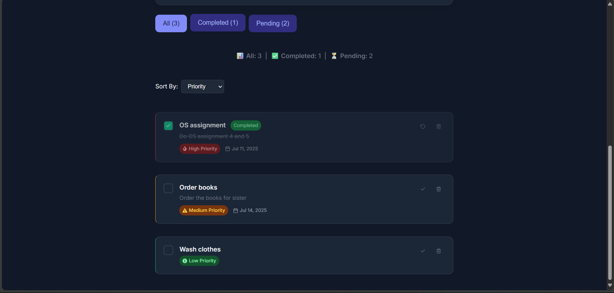

# 📋 TaskFlow

A modern, minimal task manager built with React — organize your work, track progress, prioritize efficiently, and toggle between light and dark modes. Designed to impress recruiters and simplify productivity!

---

## ✨ Features

- ✅ **Add, Complete & Delete Tasks**
- 🔍 **Search** tasks by title or description
- 📌 **Priority Labels**: High, Medium, Low with icons
- ⏳ **Due Dates** with overdue highlight
- 🧮 **Task Summary** (All / Completed / Pending)
- ⚙️ **Filter by Status**: All, Completed, Pending
- 📊 **Sort by**: Priority, Due Date, or Newest
- 🌓 **Dark / Light Mode Toggle**
- 👤 **User Login** via localStorage (no password)
- 💾 **Per‑User Task Storage** via localStorage
- 💡 Fully responsive UI (mobile & desktop)

---

## ⚙️ Tech Stack

- React.js (with Hooks)
- HTML5 + CSS3 (Responsive)
- React Icons
- localStorage (no backend)
- Deployed with Netlify / Vercel

---

## 🚀 Getting Started

### 1. Clone the Repository

```bash
git clone https://github.com/garimagoel25/taskflow.git
cd taskflow
```

### 2. Install Dependencies

```bash
npm install
```

### 3. Start the Development Server

```bash
npm start
```

The app will start on: [http://localhost:3000](http://localhost:3000)

It supports live reloading and will automatically reflect your changes.

---

## 🌐 Live Demo

👉 [Click here to try TaskFlow](https://your-deployment-link.netlify.app)

> Replace with your actual Netlify or Vercel link once deployed.

---

## 📁 Project Structure

```
taskflow/
├── public/
├── src/
│   ├── components/
│   ├── styles/
│   └── utils/
├── screenshots/
│   ├── login.png
│   ├── dashboard-light-mode.png
│   ├── dashboard-dark-mode.png
│   ├── tasks-light-mode.png
│   └── tasks-dark-mode.png
├── README.md
└── package.json
```

---

## 🙋‍♀️ Author

Made with ❤️ by **Garima Goel**  
[GitHub Profile](https://github.com/garimagoel25)

---

## 🖼️ Screenshots

### 🔐 Login Page  


### 🧾 Dashboard - Light Mode  


### 🌌 Dashboard - Dark Mode  


### 💡 Tasks - Light Mode  


### 🌙 Tasks - Dark Mode  

